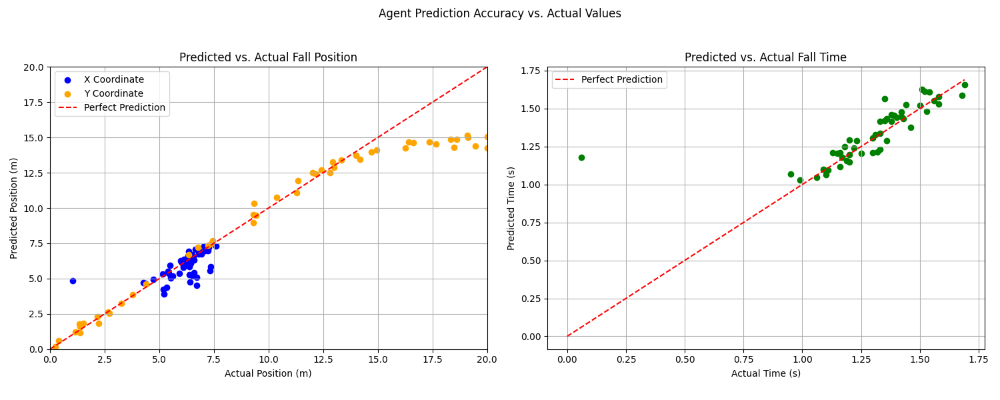
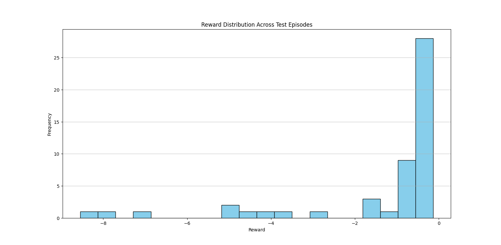

# Shuttlecock Fall Point Prediction using Reinforcement Learning

This project applies Deep Reinforcement Learning (RL) to solve a complex real-world physics problem: predicting the exact landing coordinates and flight time of a badminton shuttlecock based on its initial trajectory.

Instead of traditional analytical physics calculations, this project frames trajectory prediction as a regression task solved by an RL agent looking to minimize prediction error.

## 🚀 Features

*   **Custom 3D Physics Simulator:** Built from scratch using `gymnasium`, the physics engine accurately models the real-world flight of a shuttlecock, including its mass, area, air density, gravity, and aerodynamic drag.
*   **Adversarial Wind Simulation:** To increase prediction difficulty and realism, the environment periodically injects random velocity shifts ("wind gusts") mid-flight.
*   **PPO-based Prediction Agent:** Leverages the Proximal Policy Optimization (PPO) algorithm from `stable-baselines3` to learn the complex, non-linear mapping between initial state and final landing point.
*   **3D Visualizations & Benchmarking:** Includes interactive `matplotlib` scripts that plot both the actual simulated flight path and the AI's predicted landing spot in real-time. 

## 🧠 Approach

1.  **The Environment State:** The observation space contains a 6-value array: the shuttlecock's current 3D position `(x, y, z)` and its 3D velocity `(vx, vy, vz)`.
2.  **The Agent's Action:** The agent outputs three continuous numbers corresponding to the predicted final landing position `x`, `y`, and the `time` until it hits the ground.
3.  **The Reward Function:** The environment calculates the error between the true physics-engine landing point and the agent's prediction: `Reward = -(position_error + time_error)`. By maximizing this reward (minimizing the error), the RL regression agent learns the physics of a shuttlecock.

## 📁 Project Structure

*   **`learn/shuttlecock_env.py`**: Contains the core Gymnasium-compatible 3D physics environment.
*   **`learn/train_agent.py`**: The training script that instantiates the PPO agent and trains it for 250k timesteps on the custom environment.
*   **`learn/shuttle_sim.py`**: A robust visualization script that loads the trained model, renders real-time 3D flight paths, and displays the agent's real-time accuracy.
*   **`env_traj.py`**: Script for visualizing standalone aerodynamic trajectories with random shift perturbations.
*   **`learn/visualize_agent.py`** & **`learn/performance.py`**: Additional diagnostic and metric tracking scripts. 

## 🛠️ Usage

*Note: Ensure you have `gymnasium`, `stable-baselines3`, `numpy`, and `matplotlib` installed.*

To train the RL agent from scratch:
```bash
python learn/train_agent.py
```

To run the interactive 3D prediction visualization with the pre-trained agent:
```bash
python learn/shuttle_sim.py
```

## 📊 Results

The agent converges to high numerical accuracy after ~250k timesteps, successfully learning to account for the shuttlecock's high drag coefficient and predicting complex trajectories with minimal error. Detailed algorithm benchmarking metrics and Tensorboard plots can be generated via the `learn/performance.py` file.


### Prediction Accuracy


### Reward Distribution

